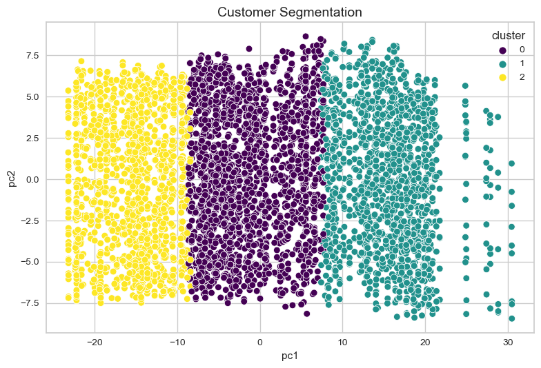

# Leveraging K-Means Clustering for Retargeting Campaign
The goal of this clustering project is to applies a K-Means Clustering machine learning model to segment customers based on their unique behavior. The outcome enables more impactful retargeting campaigns by employing personalized marketing strategies tailored to different customer segments.
 
  You can connect with me on <a href="https://www.linkedin.com/in/lanafuadi/">LinkedIn.</a>.

  
   
  Image by <a href="https://www.linkedin.com/in/lanafuadi/"> Lana Fuadi</a>

